# Tugas Pemograman Web 2
## Profil
| #               | Biodata           |
| --------------- | ----------------- |
| **Nama**        | Ilham Ramadhan    |
| **NIM**         | 312110609         |
| **Kelas**       | TI.21.A.1         |
| **Mata Kuliah** | Pemrograman Web 2 |

## Persiapan
Untuk memulai membuat kode php, perlu disiapkan web server dan interpreter PHP terlebih dahulu. Web server yang kita gunakan adalah Apache2 dan interpreter PHP 7. Untuk memudahkan proses praktikum, kita gunakan aplikasi bundle web server yaitu XAMPP.

### Install XAMPP
1. Unduh XAMPP [Disini](https://www.apachefriends.org/download.html) dan sesuaikan dengan sistem operasi kalian, lalu pilih versi php (disini saya pilih PHP 7) setelah itu klik Download.
2. Kemudian buka installer XAMPP nya, setelah itu tinggal next saja hingga selesai.
3. Secara default XAMPP itu akan disimpan dalam Local Disk (C:)
4. Buka XAMPP Control Panel.
5. Lalu klik Start pada Apache dan MySQL.
6. Kemudian uji coba apakah web server sudah bekerja dengan baik dengan mengetik http://127.0.0.1 atau http://localhost

### Memulai PHP
<p>Buat folder (lab2_php_dasar) pada root direktori web server (C:\xampp\htdocs)

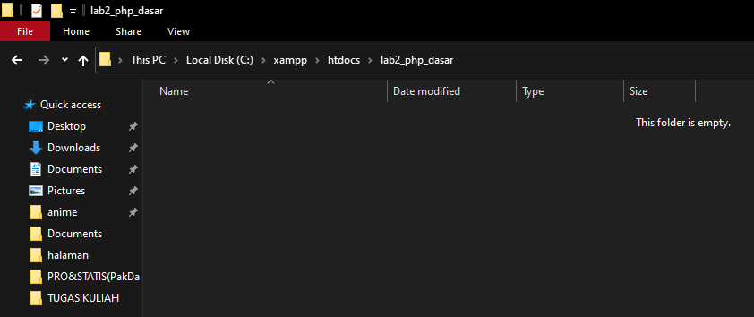

<p>Kemudian untuk mengakses direktori tersebut pada web server dengan mengakses URL: http://localhost/lab2_php_dasar/

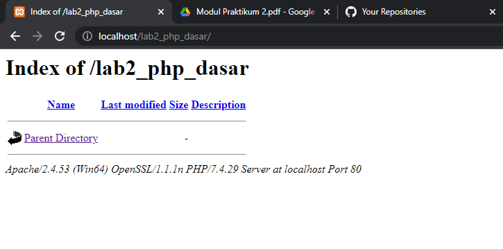

### PHP Dasar
<p>Buat file baru dengan nama (php_dasar.php) pada directory tersebut. Kemudian buat kode seperti berikut.

```html
<!DOCTYPE html>
<html lang="en">
<head>
  <meta charset="UTF-8">
  <meta http-equiv="X-UA-Compatible" content="IE=edge">
  <meta name="viewport" content="width=device-width, initial-scale=1.0">
  <title>PHP DASAR</title>
</head>
<body>
  <h1>Belajar PHP Dasar</h1> 
  <?php
  echo "Hello World!";
  ?>
</body>
</html>
```

<p>Kemudian untuk mengakses hasilnya melalui URL: http://localhost/Lab2Web/php_dasar.php

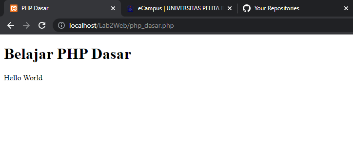

### Variable PHP
<p>Tambahkan kodingan (variable_php.php) Untuk menambahkan variable pada program.

```html
<h2>Menggunakan Variable</h2>
<?php
$nim = "312110609";
$nama = "Ilham";
echo "NIM : " . $nim . "<br>";
echo "Nama : $nama";
?>
```

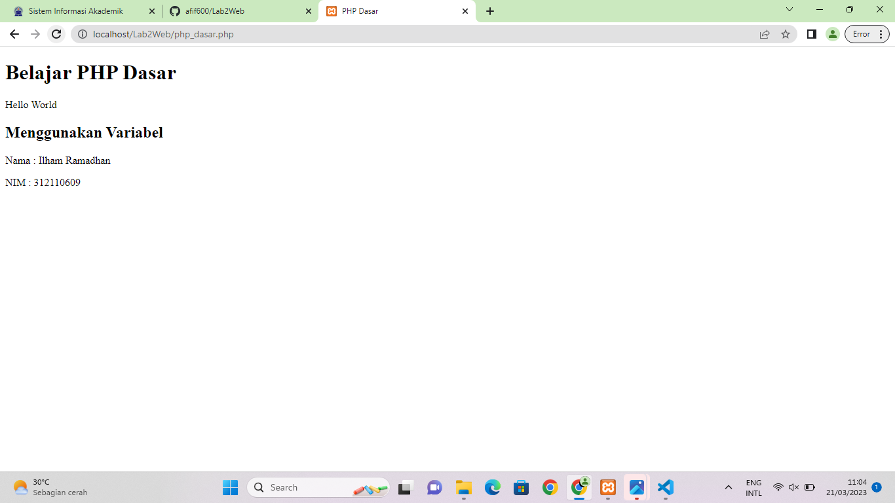

### Predefine Variable
<p>Buat file (predefine_variable.php) dalam direktori Lab2Web. lalu masukan kode berikut.

```html
<h2>Predefine Variable $_GET</h2>

<?php
echo "Selamat Datang " . $_GET['nama'];
?>
```

<p>Untuk mengaksesnya gunakan URL: http://localhost/Lab2Web/predefine_variable.php?nama=Afif 

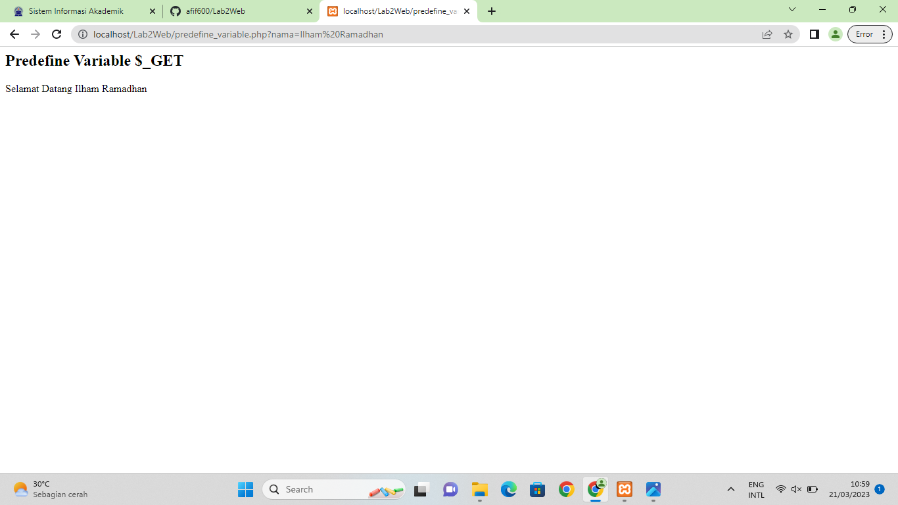

### Membuat Form Input
- Buat file (membuat_form_input.php) didalam direktori Lab2Web, Kemudian tambahkan kode berikut.

```html
<!DOCTYPE html>
<html lang="en">
<head>
  <meta charset="UTF-8">
  <meta http-equiv="X-UA-Compatible" content="IE=edge">
  <meta name="viewport" content="width=device-width, initial-scale=1.0">
  <title>PHP DASAR</title>
</head>
<body>
  <h2>Form Input</h2>
  <form action="" method="post">
    <label for="">Nama : </label>
    <input type="text" name="nama" placeholder="Masukan Nama">
    <input type="submit" value="kirim">
  </form>
  <?php
  echo "Selamat Datang " . $_POST['nama'];
  ?>
</body>
</html>
```

- Lalu inputkan sesuatu dalam kolom form tersebut, kemudian klik Kirim.
- Maka, hasilnya akan seperti berikut:

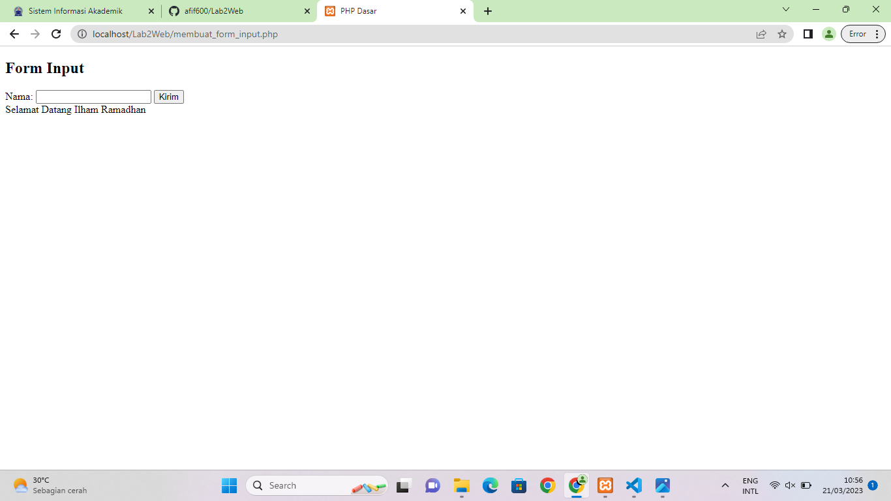

### Operator
- Buat file (operator.php) didalam direktori Lab2Web, Kemudian masukan kode berikut.

```html
$gaji = 1000000;
$pajak = 0.1;
$thp = $gaji - ($gaji*$pajak);
echo "Gaji sebelum pajak = Rp. $gaji <br>";
echo "Gaji yang dibawa pulang = Rp. $thp";
```

- Maka, hasilnya akan seperti berikut.

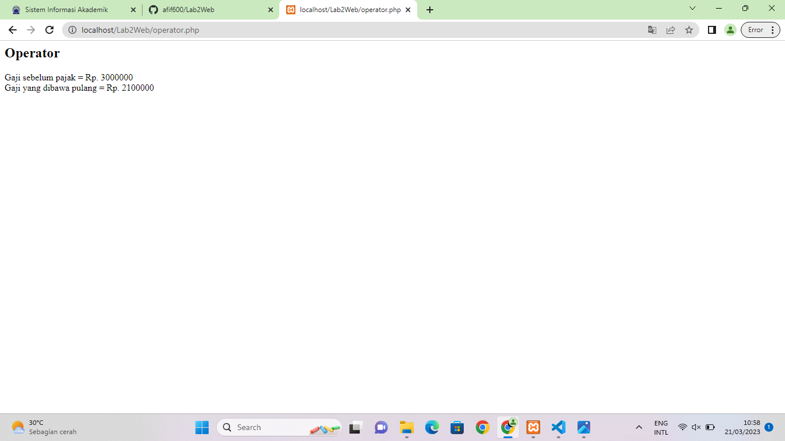

### Kondisi IF
- Buat file (kondisi_if.php) didalam direktori Lab2Web, Kemudian masukan kode berikut.

```html
$nama_hari = date("l");
if ($nama_hari == "Sunday") {
echo "Minggu";
} elseif ($nama_hari == "Monday") {
echo "Senin";
} else {
echo "Selasa";
}
```

- Maka, hasilnya akan seperti berikut.

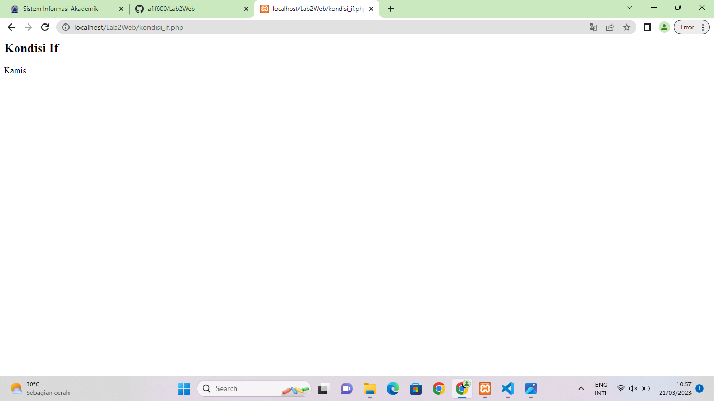

### Kondisi Switch
- Buat file (kondisi_switch.php) didalam direktori Lab2Web, Kemudian masukan kode berikut.

```html
$nama_hari = date("l");
switch ($nama_hari) {
  case "Sunday":
    echo "Minggu";
    break;
  case "Monday":
    echo "Senin";
    break;
  case "Tuesday":
    echo "Selasa";
    break;
  default:
echo "Sabtu";
}
```

- Maka, hasilnya akan seperti berikut.

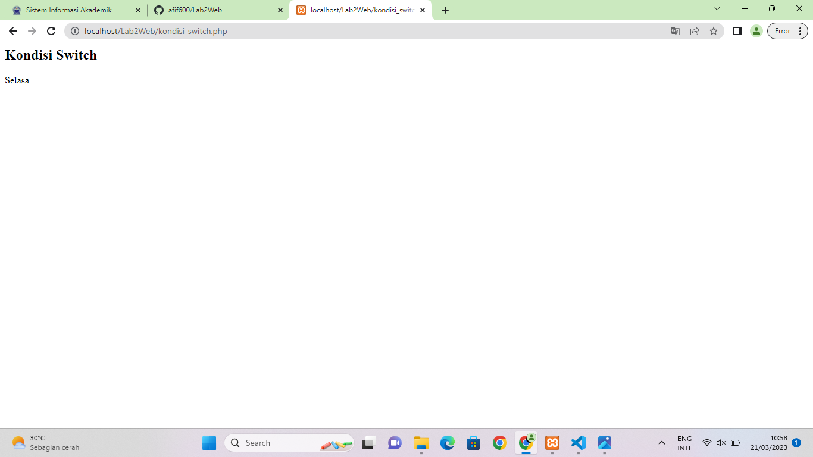

### Perulangan For
- Buat file (perulangan_for.php) didalam direktori Lab2Web, Kemudian masukan kode berikut.

```html
echo "Perulangan 1 sampai 10 <br />";
for ($i=1; $i<=10; $i++) {
echo "Perulangan ke: " . $i . '<br />';
}
echo "Perulangan Menurun dari 10 ke 1 <br />";
for ($i=10; $i>=1; $i--) {
echo "Perulangan ke: " . $i . '<br />';
}
```

- Maka, hasilnya akan seperti berikut.

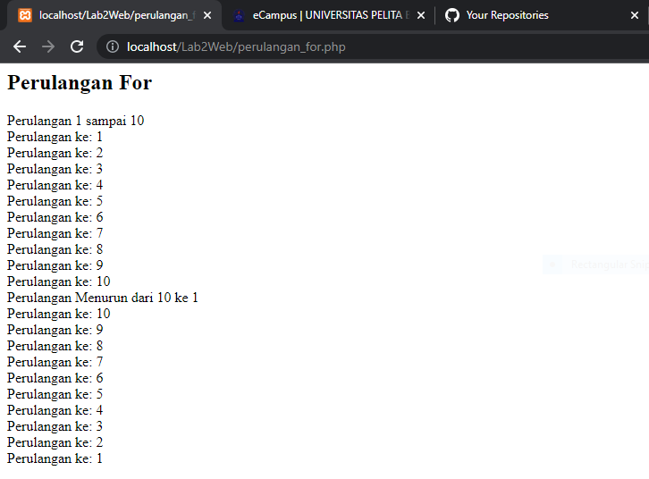

### Perulangan While
- Buat file (perulangan_while.php) didalam direktori Lab2Web, Kemudian masukan kode berikut.

```html
echo "Perulangan 1 sampai 10 <br />";
$i=1;
while ($i<=10) {
echo "Perulangan ke: " . $i . '<br />';
$i++;
}
```

- Maka, hasilnya akan seperti berikut.

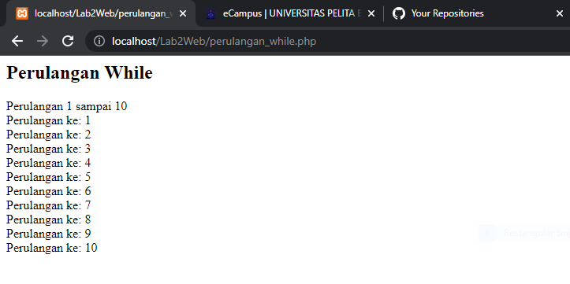

### Perulangan Do While
- Buat file (perulangan_dowhile.php) didalam direktori Lab2Web, Kemudian masukan kode berikut.

```html
echo "Perulangan 1 sampai 10 <br />";
$i=1;
do {
echo "Perulangan ke: " . $i . '<br />';
$i++;
} while ($i<=10);
```

- Maka, hasilnya sama saja dengan perulangan sebelumnya, seperti berikut.

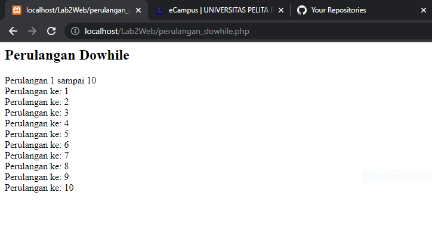

# Pertanyaan & Tugas
<p>Buatlah program PHP sederhana dengan menggunakan form input yang menampilkan nama, tanggal lahir dan pekerjaan. Kemudian tampilkan outputnya dengan menghitung umur berdasarkan inputan tanggal lahir. Dan pilihan pekerjaan dengan gaji yang berbeda-beda sesuai pilihan pekerjaan.

## Praktikum
- Buat file (index.php) dalam direktori Praktikum agar terlihat rapih.
- Lalu masukan kode berikut.

```html
<!DOCTYPE html>
<html lang="en">
  <head>
    <meta charset="UTF-8" />
    <meta http-equiv="X-UA-Compatible" content="IE=edge" />
    <meta name="viewport" content="width=device-width, initial-scale=1.0" />
    <title>Tugas</title>
    <link rel="stylesheet" href="style.css" />
  </head>
  <body>
    <h1>Tugas PHP Dasar</h1>
    <form action="" method="post" class="container">
      <div class="form-control">
        <label for="nama">Nama</label>
        <input type="text" name="nama" placeholder="Masukan nama" required />
      </div>
      <div class="form-control">
        <label for="nama">Tanggal Lahir</label>
        <input type="date" name="tgl_lahir" required />
      </div>
      <div class="form-control">
        <label for="nama">Pekerjaan</label>
        <select name="pekerjaan" required>
          <option value="">- Pilih Pekerjaan -</option>
          <option value="Web Developer">Web Developer</option>
          <option value="Data Scientist">Data Scientist</option>
          <option value="DevOps">DevOps</option>
          <option value="Mobile Application Developer">
            Mobile Application Developer
          </option>
        </select>
      </div>
      <button type="submit">Kirim</button>
    </form>

    <?php
    if ($_SERVER['REQUEST_METHOD'] == "POST" && $_POST['nama'] != '') {
        $nama = ucwords(strtolower($_POST['nama']));

        // Tanggal Lahir
        $lahir = date_format(date_create($_POST['tgl_lahir']), "d F Y");

        // Hitung Umur
        $tgl = new DateTime($_POST['tgl_lahir']);
        $today = new DateTime('today');
        $umur = $today->diff($tgl)->y;

        // Pekerjaan dan Gaji
        $pekerjaan = $_POST['pekerjaan'];
        $gaji = "";

        switch ($pekerjaan) {
            case 'Mobile Application Developer' :
                $gaji = "36 Juta";
                break;

            case 'Data Scientist':
                $gaji = "19 Juta";
                break;

            case 'Web Developer':
                $gaji = "25 Juta";
                break;

            case 'DevOps':
                $gaji = "35 Juta";
                break;

            default :
                $gaji = '0';
                break;
        }        
    ?>

    <div class="container">
      <h3>Hasil</h3>
      <hr />
      <table>
        <tr>
          <td>Nama</td>
          <td>
            :
            <?= $nama ?>
          </td>
        </tr>

        <tr>
          <td>Tanggal Lahir</td>
          <td>
            :
            <?= $lahir ?>
          </td>
        </tr>

        <tr>
          <td>Umur</td>
          <td>
            :
            <?= $umur ?>
            Tahun
          </td>
        </tr>

        <tr>
          <td>Pekerjaan</td>
          <td>
            :
            <?= $pekerjaan ?>
          </td>
        </tr>

        <tr>
          <td>Gaji</td>
          <td>: Rp.<?= $gaji ?></td>
        </tr>
      </table>
    </div>
    <?php
    }
    ?>
  </body>
</html>
```

- Kemudian buat file (style.css) didalam folder yang sama agar mudah diakses.
- Lalu, masukan kode berikut.

```bash
* {
    font-family: sans-serif;
    margin: 0;
    padding: 0;
}

h1 {
    text-align: center;
    margin: 20px 0;
}

h3 {
    text-align: center;
    margin-bottom: 10px;
}

.container {
    border: 1px solid black;
    width: 30%;
    margin: auto;
    padding: 20px;
    border-radius: 5px;
    margin-bottom: 30px;
}

.form-control {
    margin-bottom: 10px;
    display: flex;
    flex-direction: column;
}

input, select {
    padding: 5px;
    margin-top: 5px;
    border: 1px solid black;
    border-radius: 3px;
}

button {
    background-color: dodgerblue;
    border: none;
    padding: 8px;
    width: 100%; 
    color: white;
    margin-top: 10px;
    border-radius: 5px;
}

table {
    width: 100%;
}

td {
    padding: 5px 0;
}

span {
    color: red;
}
```

- Maka, hasilnya akan seperti berikut.

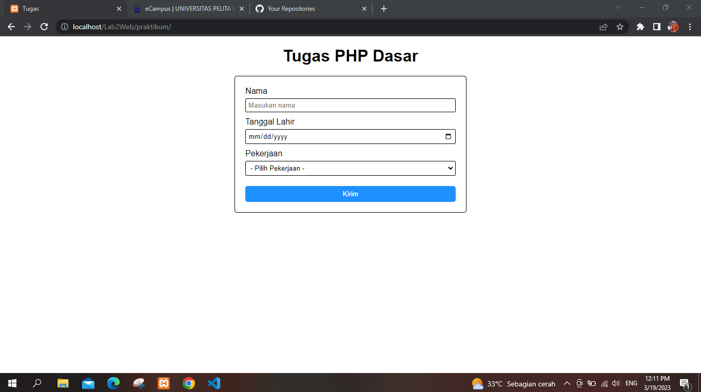

- Sesudah diinputkan.

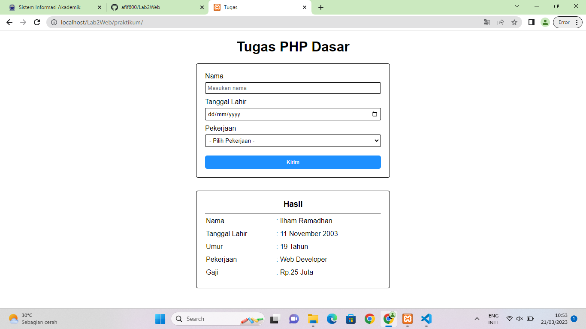

# Terima Kasih!!!
